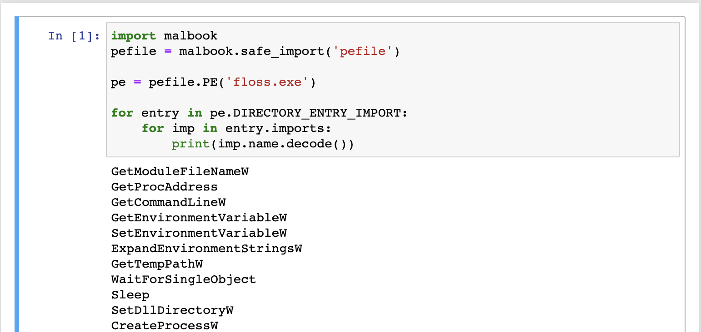

## About

Malbook is a utility for creating malware analysis templates. It manages all Python dependencies
and provides a convenient analysis task API that features automatic task order resolution.

## Installation

Install malbook using pip
```sh
$ pip install malbook
```

## Quickstart

We will create a template that prints dynamic imports of a Windows executable. First,
create an empty folder and tell malbook to treat it as a template

```sh
$ mkdir demo
$ cd demo
$ malbook new
$ malbook run
```

We will extract the dynamic import table using [pefile](https://github.com/erocarrera/pefile). 
Since this package is not part of the Python standard library, we will use a special utility function to
import it into the script

```python
import malbook
pefile = malbook.safe_import('pefile')
```

`safe_import()` will ensure that `pefile` gets installed before it is imported.
In this example, we analyze [FLOSS](https://github.com/mandiant/flare-floss).

```python
pe = pefile.PE('floss.exe')

for entry in pe.DIRECTORY_ENTRY_IMPORT:
    for imp in entry.imports:
        print(imp.name.decode())
```



After we make sure that our template works, we can distribute it to other people.
Tell malbook to package our template for distribution

```sh
$ malbook template create demo.zip
```

The file `demo.zip` can now be shared with others. Anyone who wants to use this template
can extract it with using malbook

```sh
$ malbook template load demo.zip loaded
```

This command extracts the template and installs any required dependencies.
When template is loaded, it can be launched right away

```sh
$ cd loaded
$ malbook run
```
