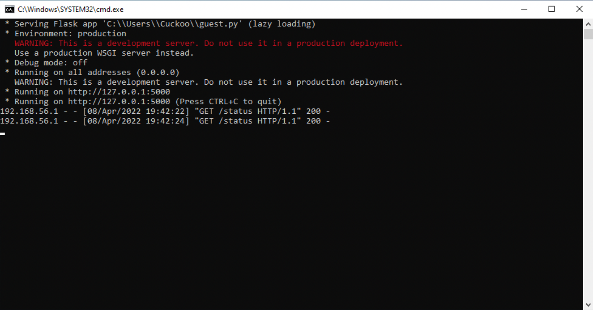

# WindowsPE - A template for analyzing Windows Portable Executable malware samples

## Requirements

## Preparing the virtual machine

> NOTE: These installation instructions were tested with macOS 12.2.1 (host), Windows 10
> 64-bit (guest), VirtualBox 6.1.32, and Python 3.9.12 (host)

1. [Create](https://www.virtualbox.org/manual/ch01.html#gui-createvm) a new Windows 10 64-bit virtual machine. Make sure that Windows is installed to 
the `C:\` drive and that the user has no password
2. [Disable](https://support.microsoft.com/en-us/windows/turn-microsoft-defender-firewall-on-or-off-ec0844f7-aebd-0583-67fe-601ecf5d774f#ID0EFD=Windows_10) the firewall and ensure that VM can accept incoming connections
3. [Disable](https://support.microsoft.com/en-us/windows/turn-off-defender-antivirus-protection-in-windows-security-99e6004f-c54c-8509-773c-a4d776b77960#:~:text=Select%20the%20Windows%20Security%20app,scans%20will%20continue%20to%20run.) Windows Defender
4. [Install](https://www.virtualbox.org/manual/ch04.html) VirtualBox guest additions
5. [Install](https://www.python.org/downloads) Python
6. [Install](https://flask.palletsprojects.com/en/2.1.x/) Flask
7. [Download](https://docs.microsoft.com/en-us/sysinternals/downloads/procmon) Process Monitor and extract `Procmon64.exe` to `C:\Procmon64.exe`
8. [Download](./guest/guest.py) the guest script and save it in `C:\guest.py`
9. [Download](./guest/start.bat) the guest launch script save it in `C:\start.bat`
10. Set up a task in Windows Task Scheduler that will start the guest script upon restart:
- Open Task Scheduler
- Click on **Create Task...**
- Go to **General** tab
- Tick **Run with highest privileges** checkbox under **Security Options**
- Select **Windows 10** under **Configure for:**
- Go to **Triggers** tab
- Click on **New...**
- Select **At log on** in **Begin the task:**
- Click on **OK**
- Go to **Actions** tab
- Select **Start a program** in **Action:**
- Click on **Browse**, go to `C:\` and select the `start.bat` script
- Click on **OK**
- Go to **Conditions** tab
- Make sure that **Start the task only if the computer is on AC power** checkbox is not ticked
- Click on **Apply**
11. Check whether the task got set up successfully by restarting the virtual machine. Upon start you should see a terminal window pop up.

12. [Set up](https://www.virtualbox.org/manual/ch06.html#network_hostonly) host-only networking in VirtualBox.
13. Finally, [take](https://www.virtualbox.org/manual/ch01.html#snapshots-take-restore-delete) a snapshot of the newly created virtual machine.

> TODO: reagentc /disable

# Acknowledgements

This work would not be possible without the following programs/libraries/services:

- [VirtualBox](https://www.virtualbox.org/)
- [BeautifulSoup](https://www.crummy.com/software/BeautifulSoup/)
- [Yara](https://github.com/VirusTotal/yara)
- [Requests](https://docs.python-requests.org/en/latest/)
- [PEiD](https://github.com/dhondta/peid)
- [PySpamSum](https://github.com/freakboy3742/pyspamsum/)
- [pefile](https://github.com/erocarrera/pefile)
- [Process Monitor](https://docs.microsoft.com/en-us/sysinternals/downloads/procmon)
- [procmon-parser](https://github.com/eronnen/procmon-parser)
- [FLOSS](https://github.com/mandiant/flare-floss)
- [StringSifter](https://github.com/mandiant/stringsifter)
- [Malware Bazaar](https://bazaar.abuse.ch/)
- [VirusTotal](https://www.virustotal.com/)
- [Yara-Rules](https://github.com/Yara-Rules/rules)