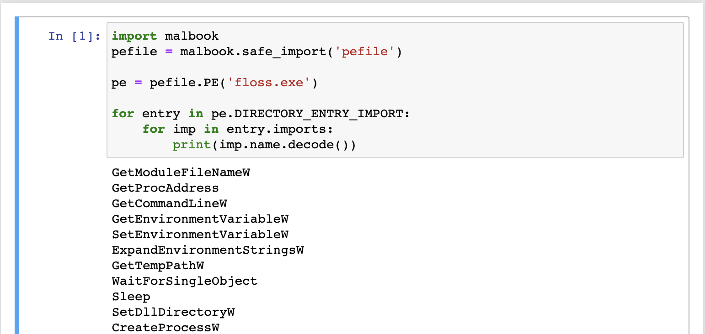

## About

malbook is a utility that aims to make it easy to create and reuse Jupyter
notebook scripts.

## Installation

Install malbook using pip
```sh
$ pip install malbook
```

## Quickstart

Let's create a Jupyter notebook that will print the import
table of the [FLOSS](https://github.com/mandiant/flare-floss) Windows executable. First, create a new
notebook

```sh
$ mkdir Demo
$ cd Demo
$ malbook new
```

You can now launch the freshly created notebook

```sh
$ malbook run
```

Let's now download and unzip the FLOSS executable

```sh
$ wget https://github.com/mandiant/flare-floss/releases/download/v1.7.0/floss-v1.7.0-windows.zip
$ unzip floss-v1.7.0-windows.zip
$ rm floss-v1.7.0-windows.zip
```

We will extract the import table using [pefile](https://github.com/erocarrera/pefile). Since this package is not installed by default, we will use a special utility function to
import it into the script

```python
import malbook
pefile = malbook.safe_import('pefile')
```

`safe_import()` will ensure that package gets installed before the module is imported.
We can now print FLOSS's import table using with this snippet

```python
pe = pefile.PE('floss.exe')

for entry in pe.DIRECTORY_ENTRY_IMPORT:
    for imp in entry.imports:
        print(imp.name.decode())
```



After we make sure that our script works, we can distribute it to other people.
This is done by creating a malbook template, which encompasses all the files inside
the folder along with all the dependencies needed by the script.

```sh
$ malbook template create Demo.zip
```

which will create a file `Demo.zip`, which can be shared with others.
Loading the template is done like so:

```sh
$ malbook template load Demo.zip LoadedDemo
```

When the template is loaded, the notebook can be launched right away.
It will contain all necessary dependencies, so you don't have to worry about
having to tell people to `pip install -r requirements.txt`

```sh
$ cd LoadedDemo
$ malbook run
```
